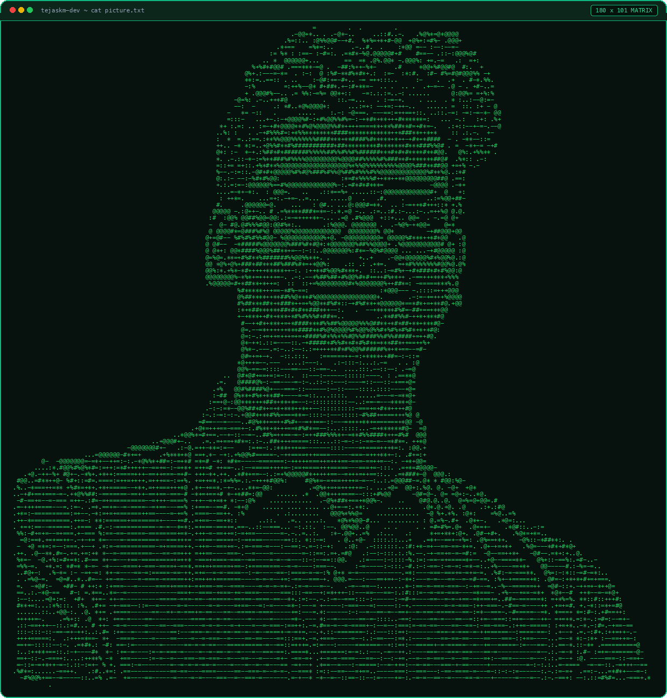
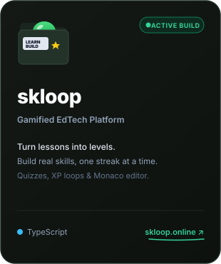
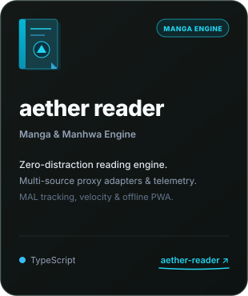
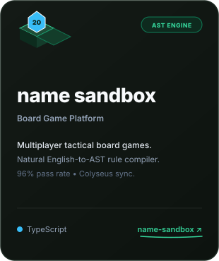
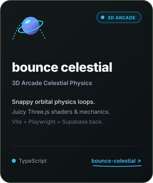
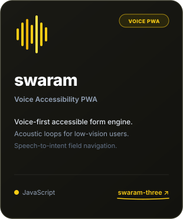
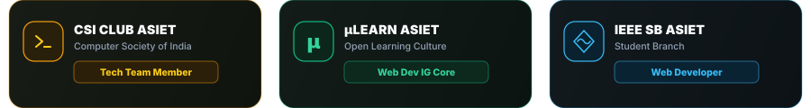
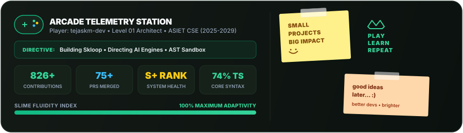
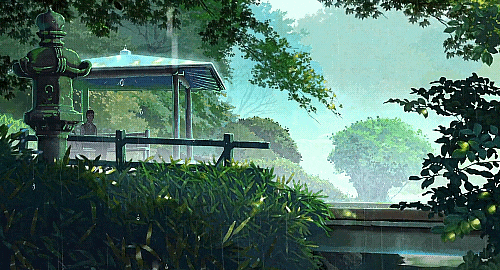

<!-- HERO BANNER -->

<!-- ANIMATED TYPING HEADER -->

 

<!-- CONTACT & SOCIAL BADGES -->

  
  &nbsp;&nbsp;&nbsp;&nbsp;&nbsp;&nbsp;
  
  &nbsp;&nbsp;&nbsp;&nbsp;&nbsp;&nbsp;
  

 

<!-- 01 ARCHITECTURAL DIRECTIVE & BIO -->

  

<table width="100%" border="0">
  <tr>
    <td width="58%" valign="middle">
      <blockquote>
        "A slime does not resist the geometry of its container — it adapts, absorbs complexity, and dissolves friction. Code is malleable; vision and systems architecture are permanent."
      </blockquote>
      

        I am <b>Tejas K M</b> (<code>tejaskm-dev</code>, or occasionally "shinz" when things crash in production), a second-year <b>BTech Computer Science &amp; Engineering</b> student at <b>ASIET</b>.
      

      

        Alongside building interactive software, 3D physics games, and compiler engines, I engineer tools on the <b>CSI Club Tech Team</b> and contribute actively across <b>µLearn</b> and <b>IEEE SB ASIET</b>. Based in Kerala, India, I operate at the intersection of systems architecture, rapid AI orchestration, and technical product execution.
      

      

        My north star is <b>technical product leadership with end-to-end ownership</b> — designing, directing, and shipping resilient software ventures that solve high-friction human problems.
      

      <h4>Directing AI Tooling</h4>
      

        I treat repetitive boilerplate as an artifact of legacy development. Instead, I direct high-leverage AI tooling (<b>Claude Code</b>, <b>Antigravity</b>, <b>Groq / Llama</b>):
      

      <ul>
        <li><b>Architecture First</b>: Defining state boundaries, schemas, and protocol contracts before triggering generation loops.</li>
        <li><b>Deep Code Literacy</b>: Staying deeply conversant with language semantics, AST transformations, event loops, and query plans to evaluate architectural trade-offs.</li>
        <li><b>Velocity with Taste</b>: Speed via AI; human taste, product intuition, and disciplined systems design determine product excellence.</li>
      </ul>
    </td>
    <td width="42%" valign="middle" align="center">
      
    </td>
  </tr>
</table>

 

<!-- 02 FEATURED ARTIFACTS & BUILDS -->

  

<table border="0" cellspacing="10" cellpadding="0">
  <tr>
    <td width="300" align="center" valign="top">
      
    </td>
    <td width="300" align="center" valign="top">
      
    </td>
    <td width="300" align="center" valign="top">
      
    </td>
  </tr>
  <tr>
    <td colspan="3" align="center">
      <table border="0" cellspacing="10" cellpadding="0">
        <tr>
          <td width="300" align="center" valign="top">
            
          </td>
          <td width="300" align="center" valign="top">
            
          </td>
        </tr>
      </table>
    </td>
  </tr>
</table>

 

> **Side Challenge**: Also engineered **Operation Vault** — a mobile-first interactive puzzle game for the CSI Club induction event featuring multi-tier cipher mechanics, rapid scoring, and puzzle gates.

 

<!-- 03 CORE TECH & DIRECTIVE STACK -->

  

  

| Tier | Absorbed Technologies &amp; Capabilities |
| :--- | :--- |
| **Frontend &amp; 3D** | React · Next.js 15 (App Router) · Three.js · TypeScript · JavaScript · Tailwind CSS · Figma · PWA |
| **Backend &amp; Realtime** | Node.js · Express · Colyseus (WebSockets) · Javalin · REST APIs |
| **Languages** | TypeScript · JavaScript · Java · Python · SQL |
| **Storage &amp; Auth** | Supabase · PostgreSQL · SQLite · IndexedDB |
| **AI Tooling &amp; Leverage** | Claude Code · Antigravity · Groq / Llama · Prompt Directing · AST Metaprogramming |
| **Workflow &amp; VCS** | Git · GitHub Actions · Linux · Turborepo · Vite |

 

<!-- 04 COMMUNITY ENGAGEMENT & ROLES -->

  

  

 

<!-- 05 ARCADE TELEMETRY & ACTIVITY -->

  

<!-- Arcade Telemetry Station with Fun Visuals, Gamepad, Sticky Notes & Crown -->

  

  <b>Contribution Grid Snake</b> • <i>Automated commit eater running daily at 00:00 UTC</i>

<!-- Platane/snk Contribution Snake -->
<picture>
  <source media="(prefers-color-scheme: dark)" srcset="https://raw.githubusercontent.com/tejaskm-dev/tejaskm-dev/output/github-contribution-grid-snake-dark.svg" />
  <source media="(prefers-color-scheme: light)" srcset="https://raw.githubusercontent.com/tejaskm-dev/tejaskm-dev/output/github-contribution-grid-snake.svg" />
  
</picture>

 

 

<!-- CINEMATIC RAIN GAZEBO FOOTER -->

  
    
  

    <b>Absorb • Adapt • Architect</b> 
    <i>Code is malleable. Systems architecture is permanent.</i>
  

