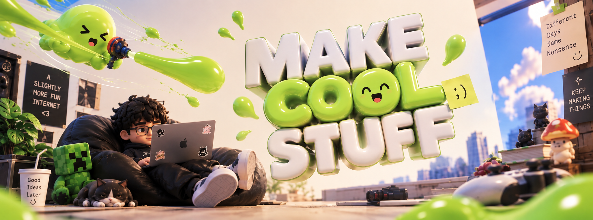

<div align="center">

<!-- HERO BANNER -->


<!-- ANIMATED TYPING HEADER -->
<a href="https://readme-typing-svg.demolab.com">
  
</a>

<!-- SOCIAL & CONTACT BADGES -->
<p align="center">
  <a href="https://linkedin.com/in/YOUR_LINKEDIN" target="_blank">
    
  </a>
  <a href="https://x.com/YOUR_TWITTER" target="_blank">
    
  </a>
  <a href="https://YOUR_PORTFOLIO_URL" target="_blank">
    
  </a>
  <a href="mailto:YOUR_EMAIL@example.com">
    
  </a>
</p>

<!-- SLIME STATUS TERMINAL -->
<pre>
┌── [ SLIME SYSTEM TELEMETRY // SHINZ-OS ] ──────────────────────────────────────────────┐
│ 🧪 Identity    : Tejas K M ("Shinz") · Co-Founder @ Skloop                             │
│ 🎓 Academic    : BTech CSE @ ASIET (2025–2029) · Batch Class Representative            │
│ 🧬 Mutation    : AI-Directed Engineering (Claude Code · Antigravity · Groq/Llama)      │
│ 🟢 Fluidity    : Full-Stack Architecture · Real-time Multiplayer · AST Parser Engines  │
│ 📍 Habitat     : Kerala, India                                                         │
│ 🎯 Quest Line  : Technical Product Leadership · End-to-End Venture Scale               │
└────────────────────────────────────────────────────────────────────────────────────────┘
</pre>

</div>

---

### 🧪 // WHO I AM

> *"A slime doesn't fight the geometry of its container — it adapts, absorbs complexity, and dissolves friction. Code is malleable; vision is permanent."*

I'm **Tejas K M** (known online as **Shinz**), a first-year **BTech Computer Science & Engineering** student at **ASIET** (Class of 2029) and **Co-Founder of Skloop**. 

Alongside building ventures, I serve as the **Class Representative** for my batch, contribute on the **CSI Club Tech Team**, and remain an active builder in **µLearn** and **IEEE SB ASIET**. Based out of Kerala, India, I operate at the intersection of technical systems architecture and high-velocity product execution.

My north star is **technical product leadership with end-to-end ownership** — building, steering, and scaling independent ventures that solve high-friction human problems.

---

### ⚡ // HOW I BUILD: DIRECTING AI TOOLING

I view traditional hand-coding of repetitive boilerplate as an artifact of the past. Instead, I **direct modern AI tooling** (**Claude Code**, **Antigravity**, **Groq / Llama**) at high leverage:

- **Architect First**: Design contracts, state boundaries, relational models, and event protocols before touching an implementation loop.
- **Deep Code Literacy**: I don't "vibe-code" into a black box. I stay deeply literate across language semantics, ASTs, event loops, and database queries so I can instantly debug edge-cases, inspect assembly or transpiler outputs, and make high-stakes architectural decisions.
- **Velocity with Taste**: AI accelerates the typing; human taste, product intuition, and rigorous systems design ensure the outcome is exceptional.

---

### 🦠 // FEATURED PROJECTS

<table width="100%">
  <tr>
    <td width="50%" valign="top">
      <h3>🟢 01. Skloop</h3>
      <p><b>Role:</b> Co-Founder · Architecture · UI · Product Experience</p>
      <p>Gamified edtech platform engineered around rich narrative worlds: the <b>Loopverse</b> and the <b>Underlayer</b>.</p>
      <ul>
        <li><b>Loopy:</b> Embedded AI companion with dynamic dual personalities that mentor and stress-test learners.</li>
        <li><b>Game Mechanics:</b> XP feedback loops, quest trees, shop systems, and inventory progression.</li>
        <li><b>Integrated Editor:</b> In-browser Monaco Editor environment for live interactive programming.</li>
      </ul>
      <p>
        <code>Next.js</code> · <code>TypeScript</code> · <code>Monaco</code> · <code>AI Agents</code> · <code>Supabase</code>
      </p>
      <p>
        <a href="https://github.com/YOUR_GITHUB_USERNAME/skloop"><b>View Repository →</b></a>
      </p>
    </td>
    <td width="50%" valign="top">
      <h3>🫧 02. Aether Reader</h3>
      <p><b>Role:</b> Creator & Lead Architect · <i>Shipped (Private / Non-monetized)</i></p>
      <p>Full-stack manga & manhwa reader Progressive Web App built for blazing-fast, distraction-free reading.</p>
      <ul>
        <li><b>Source-Adapter Pattern:</b> Modular proxy architecture seamlessly aggregating multiple scanlation scrapers.</li>
        <li><b>Reading Intelligence:</b> MAL-style tracking with granular history and reading analytics dashboard.</li>
        <li><b>Offline PWA:</b> Service worker caching and resilient local IndexedDB state syncing.</li>
      </ul>
      <p>
        <code>Next.js 15</code> · <code>TypeScript</code> · <code>Tailwind CSS</code> · <code>Express</code> · <code>Supabase Auth</code>
      </p>
      <p>
        <a href="https://github.com/YOUR_GITHUB_USERNAME/aether-reader"><b>View Architecture →</b></a>
      </p>
    </td>
  </tr>
  <tr>
    <td width="50%" valign="top">
      <h3>🧬 03. NAME Sandbox</h3>
      <p><b>Role:</b> Core Systems Engineer</p>
      <p>Tile-based multiplayer board game creation platform with real-time state synchronization.</p>
      <ul>
        <li><b>English-to-AST Parser:</b> Custom natural-language rule compiler achieving a <b>~96% pass rate</b> across 386 test cases.</li>
        <li><b>Combat Mechanics:</b> Deep hybrid tactical engine fusing Pokémon type matchups with D&D d20 action economy.</li>
        <li><b>State Sync:</b> Ultra-low-latency deterministic game rooms powered by Colyseus rooms.</li>
      </ul>
      <p>
        <code>Colyseus</code> · <code>Next.js</code> · <code>Supabase</code> · <code>AST Engine</code> · <code>TypeScript</code>
      </p>
      <p>
        <a href="https://github.com/YOUR_GITHUB_USERNAME/name-sandbox"><b>View Engine Docs →</b></a>
      </p>
    </td>
    <td width="50%" valign="top">
      <h3>🛡️ 04. Academic Integrity Engine</h3>
      <p><b>Role:</b> Backend & Detection Engine Architect (4-person team)</p>
      <p>Pluggable code-plagiarism and AI-authorship detection system engineered for the KTU OOP course.</p>
      <ul>
        <li><b>Multi-Language AST Engine:</b> Tokenized structural analysis supporting Java, C, C++, Python, and JavaScript.</li>
        <li><b>Detection Pipeline:</b> Combines Winnowing fingerprinting with heuristic AI stylistic fingerprint markers.</li>
        <li><b>Lightweight REST Core:</b> High-throughput Javalin microservice coupled with an embedded SQLite datastore.</li>
      </ul>
      <p>
        <code>Java Core</code> · <code>Javalin</code> · <code>SQLite</code> · <code>AST Analysis</code> · <code>REST API</code>
      </p>
      <p>
        <a href="https://github.com/YOUR_GITHUB_USERNAME/academic-integrity-engine"><b>View Source Code →</b></a>
      </p>
    </td>
  </tr>
</table>

#### 🧪 Notable Side Quests:
- **Swaram**: Voice-first, high-accessibility form-filling PWA designed specifically for blind and low-vision users.
- **Operation Vault**: Mobile-first puzzle game engineered for the CSI Club induction event.

---

### 🧬 // TECH STACK & ABSORBED ABILITIES

<div align="center">

<!-- Skill Icons -->
<a href="https://skillicons.dev">
  
</a>

<br/><br/>

| Tier | Absorbed Skills & Technologies |
| :--- | :--- |
| **Frontend & UX** | React · Next.js 15 (App Router) · TypeScript · JavaScript · Tailwind CSS · Figma · PWA |
| **Backend & Realtime** | Node.js · Express · Colyseus (WebSockets) · Javalin · REST APIs |
| **Languages** | TypeScript · JavaScript · Java · Python · SQL |
| **Storage & Auth** | Supabase · PostgreSQL · SQLite · IndexedDB |
| **AI Tooling & Leverage** | Claude Code · Antigravity · Groq / Llama · Prompt Directing · AST Metaprogramming |
| **Workflow & VCS** | Git · GitHub Actions · Linux · Turborepo |

</div>

---

### 🟢 // CURRENT FREQUENCIES

```yaml
Current Activations:
  - Role: Class Representative (BTech CSE 2025–2029)
    Institution: Adi Shankara Institute of Engineering & Technology (ASIET)
    Location: Kalady, Kerala, India

  - Organization: CSI Club ASIET
    Position: Tech Team Member
    Focus: Technical event infrastructure, interactive student challenges (e.g. Operation Vault)

  - Organization: µLearn ASIET
    Position: Web Dev Interest Group (IG) Core
    Focus: Mentoring peers, organizing build bootcamps, full-stack culture

  - Organization: IEEE SB ASIET
    Position: Web Developer (WordPress)
    Focus: Digital presence, society event portals, platform maintenance
```

---

### 📊 // SLIME TELEMETRY & CONTRIBUTION GRID

<div align="center">

#### 🐍 Evolving Contribution Grid
<!-- Platane/snk contribution grid dark/light switch -->
<picture>
  <source media="(prefers-color-scheme: dark)" srcset="https://raw.githubusercontent.com/YOUR_GITHUB_USERNAME/YOUR_GITHUB_USERNAME/output/github-contribution-grid-snake-dark.svg" />
  <source media="(prefers-color-scheme: light)" srcset="https://raw.githubusercontent.com/YOUR_GITHUB_USERNAME/YOUR_GITHUB_USERNAME/output/github-contribution-grid-snake.svg" />
  
</picture>

<br/><br/>

#### 🏆 Slime Achievements


<br/><br/>

#### 📈 Activity & Streak Metrics


<br/><br/>

<table align="center" border="0">
  <tr>
    <td align="center">
      
    </td>
    <td align="center">
      
    </td>
  </tr>
  <tr>
    <td colspan="2" align="center">
      
    </td>
  </tr>
</table>

</div>

---

<!-- WAVING SLIME FOOTER -->
<div align="center">
  
</div>
