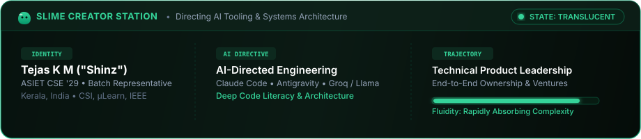
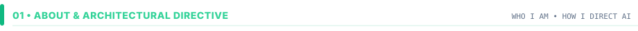
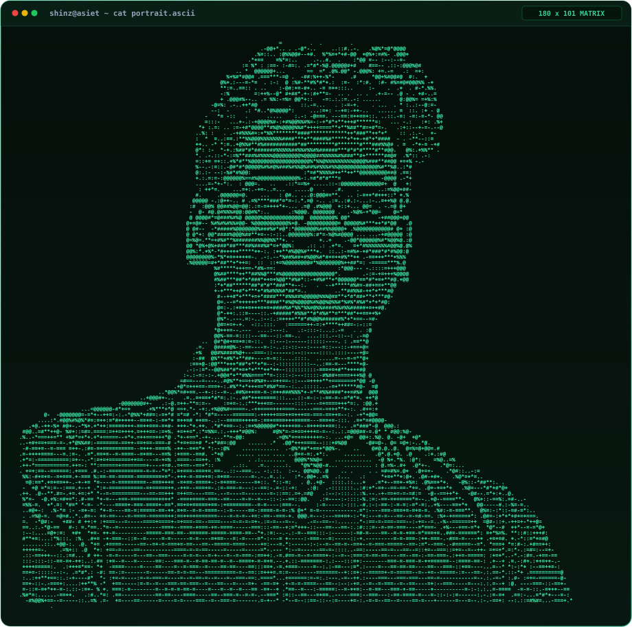
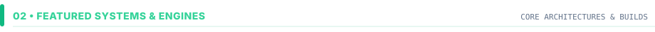
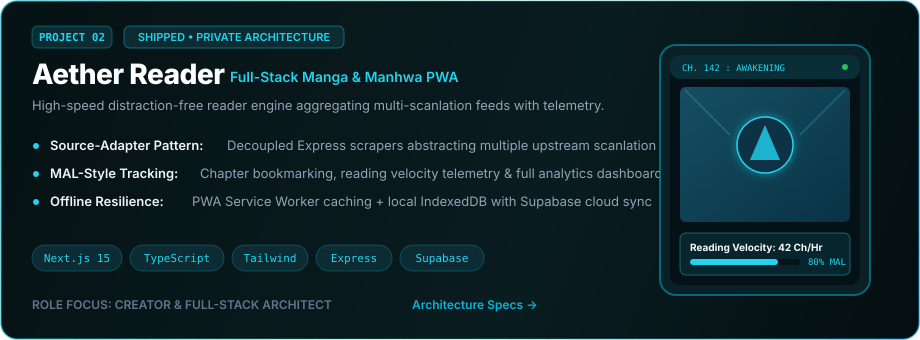
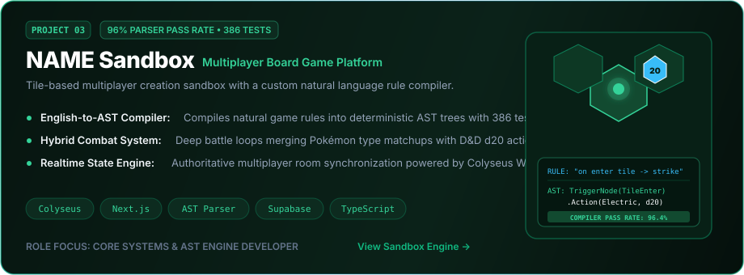
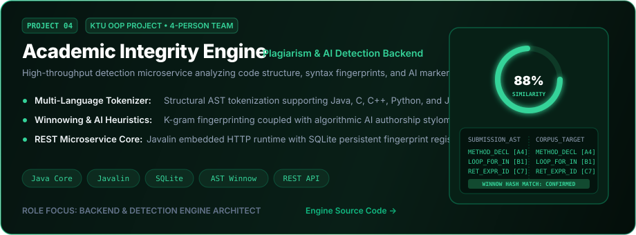
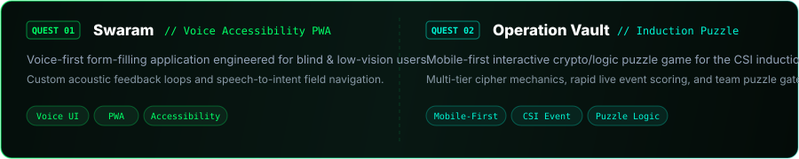
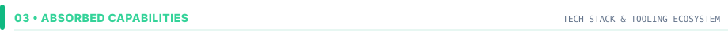
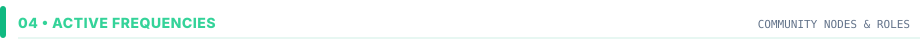

<div align="center">

<!-- HERO BANNER -->


<!-- ANIMATED TYPING HEADER -->
<a href="https://readme-typing-svg.demolab.com">
  
</a>

<!-- CONTACT & SOCIAL BADGES -->
<p align="center">
  <a href="https://linkedin.com/in/YOUR_LINKEDIN" target="_blank">
    
  </a>
  <a href="https://x.com/YOUR_TWITTER" target="_blank">
    
  </a>
  <a href="https://YOUR_PORTFOLIO_URL" target="_blank">
    
  </a>
  <a href="mailto:YOUR_EMAIL@example.com">
    
  </a>
</p>

<!-- DETAILED SLIME CREATOR HUD -->


</div>

<br/>

<!-- SECTION 01: ABOUT & DIRECTIVE -->
<p align="center">
  
</p>

> "A slime does not resist the geometry of its container — it adapts, absorbs complexity, and dissolves friction. Code is malleable; vision and systems architecture are permanent."

I am **Tejas K M** (known online as **Shinz**), a first-year **BTech Computer Science & Engineering** student at **ASIET** (Class of 2029).

Alongside building interactive software and parser engines, I serve as the **Class Representative** for my batch, engineer tools on the **CSI Club Tech Team**, and contribute actively across **µLearn** and **IEEE SB ASIET**. Based in Kerala, India, I operate at the intersection of systems architecture, rapid AI orchestration, and technical product execution.

My north star is **technical product leadership with end-to-end ownership** — designing, directing, and shipping resilient software ventures that solve high-friction human problems.

#### Directing AI Tooling

I treat repetitive boilerplate as an artifact of legacy development. Instead, I direct high-leverage AI tooling (**Claude Code**, **Antigravity**, **Groq / Llama**):

- **Architecture First**: Defining state machines, entity boundaries, and protocol contracts before triggering generation loops.
- **Deep Code Literacy**: Staying deeply conversant with language semantics, AST transformations, event loops, and relational schemas to debug complex race conditions and evaluate architectural trade-offs.
- **Velocity with Taste**: AI accelerates execution speed; human taste, disciplined product intuition, and rigorous systems design determine product excellence.

<br/>

<p align="center">
  
</p>

<br/>

<!-- SECTION 02: FEATURED SYSTEMS & ENGINES -->
<p align="center">
  
</p>

<p align="center">
  <a href="https://github.com/tejaskm-dev/skloop">
    
  </a>
</p>

<p align="center">
  <a href="https://github.com/tejaskm-dev/aether-reader">
    
  </a>
</p>

<p align="center">
  <a href="https://github.com/tejaskm-dev/name-sandbox">
    
  </a>
</p>

<p align="center">
  <a href="https://github.com/tejaskm-dev/academic-integrity-engine">
    
  </a>
</p>

<p align="center">
  
</p>

<br/>

<!-- SECTION 03: TECH STACK -->
<p align="center">
  
</p>

<div align="center">

<a href="https://skillicons.dev">
  
</a>

<br/><br/>

| Tier | Absorbed Technologies &amp; Capabilities |
| :--- | :--- |
| **Frontend &amp; UX** | React · Next.js 15 (App Router) · TypeScript · JavaScript · Tailwind CSS · Figma · PWA |
| **Backend &amp; Realtime** | Node.js · Express · Colyseus (WebSockets) · Javalin · REST APIs |
| **Languages** | TypeScript · JavaScript · Java · Python · SQL |
| **Storage &amp; Auth** | Supabase · PostgreSQL · SQLite · IndexedDB |
| **AI Tooling &amp; Leverage** | Claude Code · Antigravity · Groq / Llama · Prompt Directing · AST Metaprogramming |
| **Workflow &amp; VCS** | Git · GitHub Actions · Linux · Turborepo |

</div>

<br/>

<!-- SECTION 04: ACTIVE FREQUENCIES -->
<p align="center">
  
</p>

```yaml
Active Activations:
  - Role: Class Representative (BTech CSE 2025–2029)
    Institution: Adi Shankara Institute of Engineering & Technology (ASIET)
    Location: Kalady, Kerala, India

  - Organization: CSI Club ASIET
    Position: Tech Team Member
    Focus: Technical event infrastructure, interactive student challenges (e.g. Operation Vault)

  - Organization: µLearn ASIET
    Position: Web Dev Interest Group (IG) Core
    Focus: Mentoring peers, organizing build bootcamps, full-stack development culture

  - Organization: IEEE SB ASIET
    Position: Web Developer (WordPress)
    Focus: Digital presence, society event portals, platform maintenance
```

<br/>

<!-- SECTION 05: TELEMETRY & ACTIVITY -->
<p align="center">
  
</p>

<div align="center">

<!-- Platane/snk Contribution Snake -->
<picture>
  <source media="(prefers-color-scheme: dark)" srcset="https://raw.githubusercontent.com/tejaskm-dev/tejaskm-dev/output/github-contribution-grid-snake-dark.svg" />
  <source media="(prefers-color-scheme: light)" srcset="https://raw.githubusercontent.com/tejaskm-dev/tejaskm-dev/output/github-contribution-grid-snake.svg" />
  
</picture>

<br/><br/>

<table align="center" border="0">
  <tr>
    <td align="center">
      
    </td>
    <td align="center">
      
    </td>
  </tr>
  <tr>
    <td colspan="2" align="center">
      
    </td>
  </tr>
</table>

</div>

<br/>

<!-- WAVING SLIME FOOTER -->
<div align="center">
  
</div>
